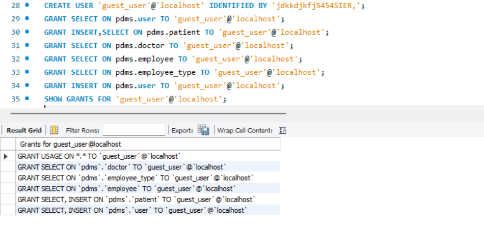
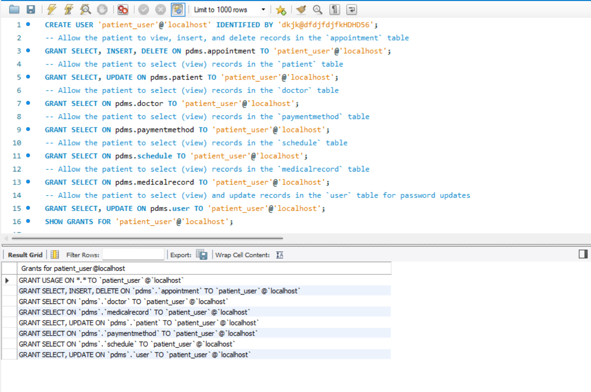
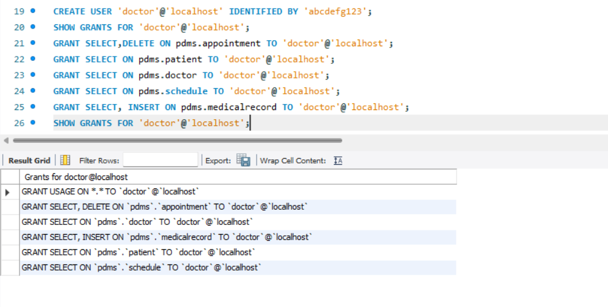
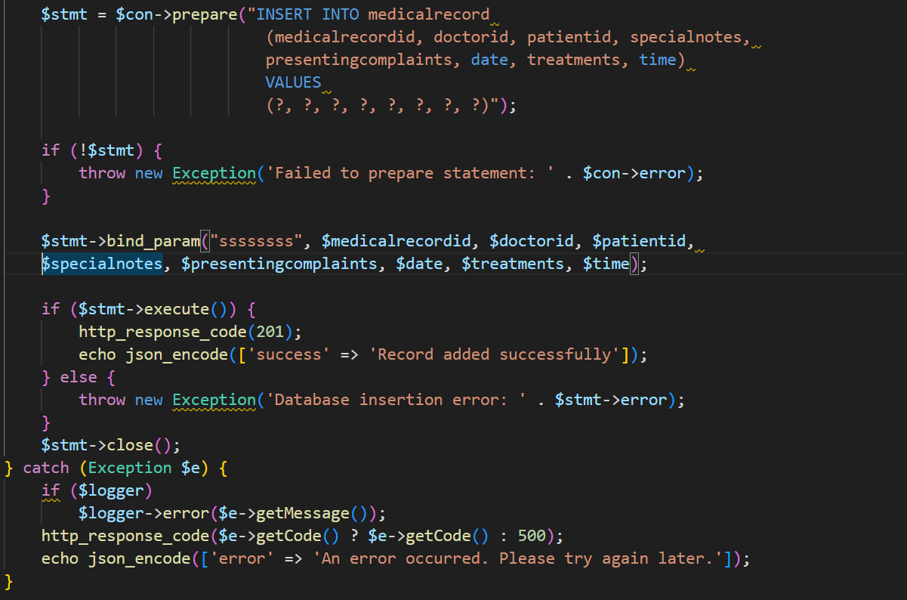
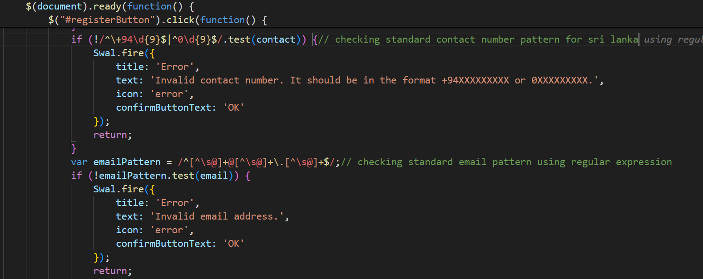
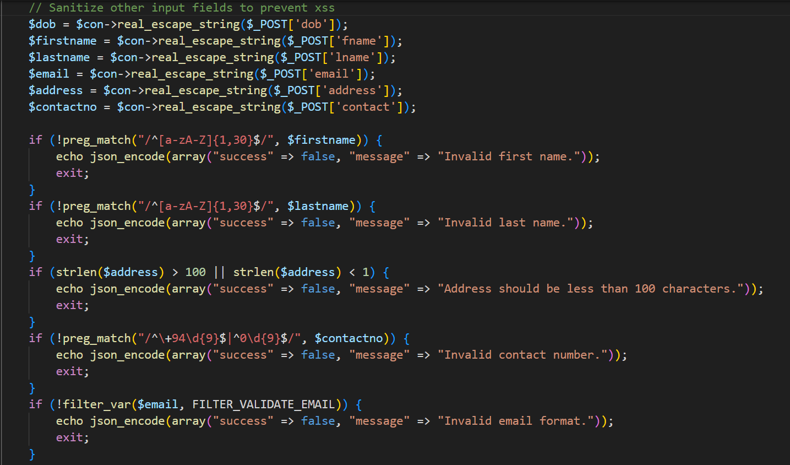
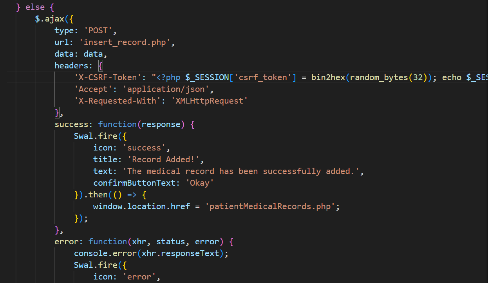
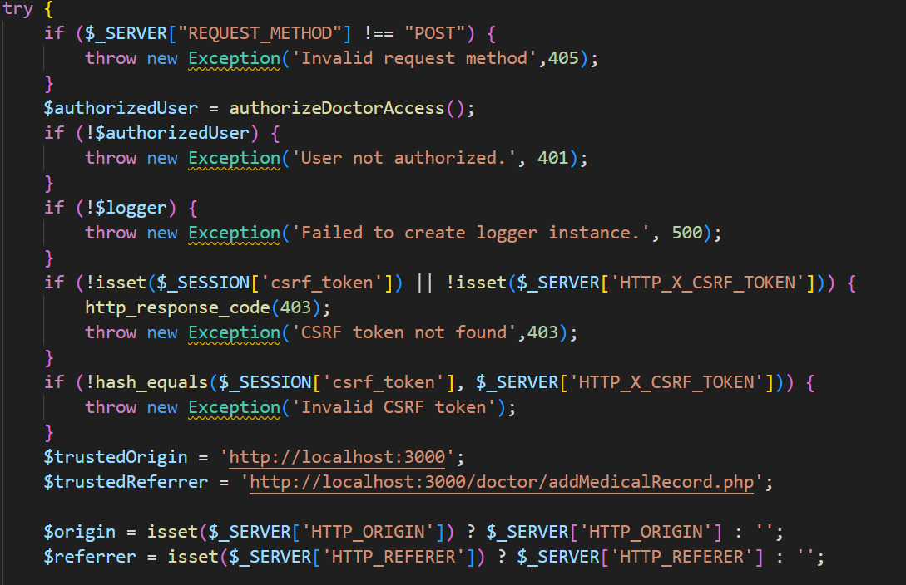
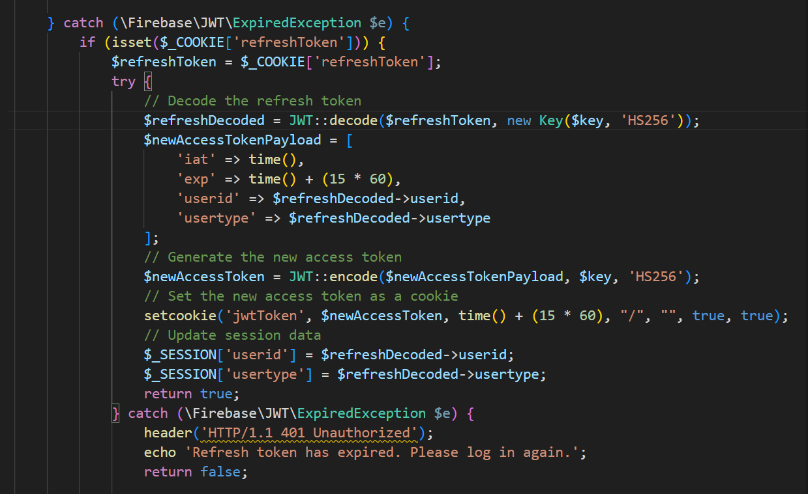

# Dental-Management-with-Added-Security

## Contributors 🏅
* [Vishan Perera](https://github.com/VishanPerera)
* [Nisal Wickramaarachchi](https://github.com/NisalWick2002)

## Project Overview 📋
The **Dental Surgery Data Management System** is an extensive project utilizing HTML, JavaScript, Bootstrap, CSS, PHP, MySQL, Figma, Visual Studio Code, and a WAMP server. This system provides functionalities for managing appointments, patient records, and other critical dental surgery operations, enhancing productivity and efficiency. Authentication, authorization, and integrity are all maintained with enhanced security features.

## Table of Contents 📚
- [Overview](#overview-)
- [Objectives](#objectives-)
- [Operations](#operations-)
- [Features](#features-)
- [Technologies Used](#technologies-used-)
- [Installation](#installation-)
- [Usage](#usage-)
- [Security Measures](#security-measures-)
- [Images](#images-)
- [Contributing](#contributing)
- [License](#license)

## Overview 📋
This comprehensive project represents the culmination of year-end efforts. Designed as a robust solution, it efficiently manages vast amounts of data with precision, elevating the dental surgery it serves to a pinnacle of excellence. Key features include appointment scheduling, patient records management, and real-time updates for medical practitioners.

## Objectives 🎯
- **Streamline Data Management**: Replace time-consuming paper-based systems with efficient digital processes.
- **Enhance Security**: Implement data encryption, password protection, and input validation to safeguard sensitive data.
- **Ensure Data Integrity**: Regular backups and data recovery procedures ensure uninterrupted operations.
- **Real-Time Updates**: Medical practitioners can easily access and update schedules in real-time.
- **Automated Reporting**: Management benefits from automated facility request processing and streamlined reporting.
- **Accurate Calculations**: Transition from manual to computerized methods for improved precision.
- **Patient Access**: Patients can securely view and download their medical records.

### Pre-Implementation Process
Before implementing this solution, dental center operations relied heavily on manual processes for appointment scheduling, patient data recording, and treatment management. These methods were time-consuming and prone to errors, often requiring significant staff intervention.

## Operations 🔧
- **Appointment Booking, viewing, searching, and canceling for patients**
- **Medical Record viewing and downloading**
- **Profile updating**
- **Patient Records Management**
- **Employee Management**
- **View and search patient medical records for doctors**
- **Add new medical records**
- **View doctor schedules**

The project revolutionizes dental surgery operations with a technology-driven approach to data management and healthcare provision.

## Features 🔐
- **Captcha Integration**: Protects against bots and brute-force attacks.
- **Limited Login Attempts**: Protects against brute-force attacks.
- **Password Security**: Bcrypt hashing with salting ensures secure password storage and encryption using a secret key before making HTTP requests.
- **User Validation**: Validates required input fields from the backend and frontend before processing using regex.
- **Input Sanitization**: Prevents malicious input, ensuring system integrity and XSS attack prevention.
- **Parameterized SQL Queries**: Guards against SQL injection attacks.
- **Session Management**: Secure sessions with HTTPS, SameSite cookie attributes, and session timeout using JWT Token with refresh token mechanism.
- **CSRF Token Validation**: Ensures requests are coming only from the intended users.
- **Monolog Library for Logging**: Logs all error messages with different levels (critical, warning) and information messages (e.g., login times).
- **Database User Permissions**: Restricted access to the database based on user roles by using different users in the database.

## Technologies Used
- **Frontend**: HTML, JavaScript, Bootstrap, CSS, Figma
- **Backend**: PHP, MySQL
- **Tools**: Visual Studio Code, PHP built-in server, WAMP server (optional)
- **Testing**: SonarQube, SonarLint

## Images 📸
Here are some images that illustrate how error handling and database permissions are implemented:

- **Database User Permissions Guest**:
  
  *Description: This image showcases the setup for guest user with restricted permissions.*
  
- **Database User Permissions Patient**:
  
  *Description: This image showcases the setup for patient user with restricted permissions.*
  
- **Database User Permissions Doctor**:
  
  *Description: This image showcases the setup for doctor user with restricted permissions.*

- **Error Handling Example**:
  
  *Description: Example of parameterized queries, exception handling with error logs using Monolog, categorizing errors into levels like critical, warnings, and info.*

- **Input Validation front end**:
  
  *Description: Input validation process ensuring that all required fields are sanitized before processing.*

- **Input Validation back end**:
  
  *Description: Input validation process ensuring that all required fields are sanitized before processing.*

- **CSRF Token mechanism**:
  
  *Description: Generating random token and passing while saving to the session to check from the server.*

- **CSRF Token mechanism**:
  
  *Description: Generating random token and passing while saving to the session to check from the server.*

- **JWT Token for authentication and authorization**:
  
  *Description: Time out users and authorizing.*
  
## Installation
1. **Clone the Repository:**
   ```bash
   git clone https://github.com/NisalWick2002/Dental-Surgery-Data-Management-System.git
   cd dental-surgery-management
2. **Set Up the PHP Environment**
   ```
   php -S localhost:8000
